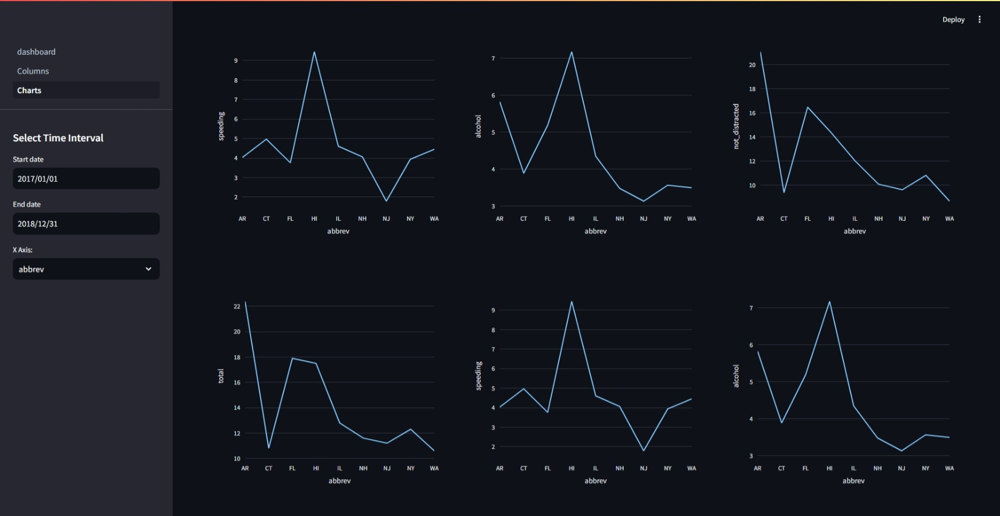
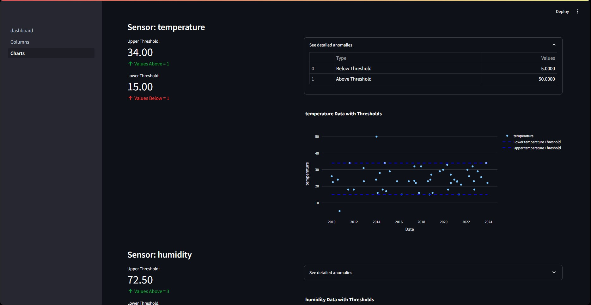

# Sensor Data Dashboard

This project is a **Sensor Data Dashboard** built using **Streamlit**, a powerful framework for creating interactive web applications in Python. The dashboard is designed to visualize and analyze dummy sensor data, providing insights through various charts and analytics tools.

----------

## Features

-   **Data Visualization:** Display sensor data in the form of line charts, bar graphs, and scatter plots.
-   **Real-Time Updates:** Support for streaming real-time dummy sensor data.
-   **Interactive UI:** Filters and controls for user-defined data analysis.
-   **Responsive Design:** Optimized for different screen sizes.
-    **Threshold Analysis:** Analyze sensor data against predefined thresholds to detect anomalies. 
-    **KPI Monitoring:** Track key performance indicators derived from sensor data.
----------

## Technologies Used

-   **Python:** Core programming language
-   **Streamlit:** Framework for creating the dashboard
-   **Pandas:** Data manipulation and analysis
-   **Matplotlib/Plotly:** Data visualization

----------
# KPI Preview


# Threshold Analysis Preview


## Installation

1.  Clone this repository:
    
    ```bash
    git clone https://github.com/CodeInfinity007/SensorDashboard.git
    cd SensorDashboard
    ```
    
2.  Activate the virtual environment:
    
    ```bash
    source venv/bin/activate  # On Windows use `venv\Scripts\activate`
    ```
    

----------

## Usage

1.  Run the Streamlit app:
    
    ```bash
    streamlit run dashboard.py
    ```
    
2.  Open your browser and navigate to the displayed local URL (usually `http://localhost:8501`).

----------

## Project Structure

```
SensorDashboard/
├── pages/                # Folder for storing site pages
├── venv/                 # Virtual environment
├── config.ini            # Sql Credentials
├── sensor.csv            # Raw sensor data file
├── Dashboard.py          # Main Streamlit app
├── sql_setup.py          # SQL setup script
└── README.md             # Project documentation
```

----------

## Analysis Features

-   **Temperature Monitoring:** Graph to show temperature trends over time.
-   **Humidity Analysis:** Visualize humidity fluctuations.
-   **Anomaly Detection:** Highlight unusual sensor data points.
-   **Key Performance Indicators:** Graph with key indicators

----------

## Future Improvements

-   Integrate real sensor data via IoT devices.
-   Add authentication and user management.
-   Implement advanced data analytics.

